# Save-the-lost-friend
A game made for JS13k 2017 competition by @higherordergame and @rskgames.

### Base code
The code from chapter 15 of the book Eloquent JavaScript 2nd edition written by Marijn Haverbeke (http://eloquentjavascript.net/15_game.html) is used as the base code.

### Game features
1. Randomized level generation
2. 2d Platformer and 2d top down levels present. Total 5 levels.
3. Dialog with the NPC players
4. Art assets generation in code

### Game story
The player starts the game in a shark infested large water body. The first goal is to understand who the player is and what is the players mission.

Standing at one place can risk an attack by sharks. There are many islands scattered
across the water body. The player needs to explore and go to the different islands.
There are various guardians across the islands. The player needs to talk to the guardian to understand the mission as well proceed further. Each guardian is associated to one primary element. The primary elements are earth, water , fire and air. Each of the guardians gives the player a key to the island associated with the guardian's element, a direction to reach the island and a quest.

On speaking with the guardians the player understands that many people are lost
including his friend. Different keys open up access to previously restricted different islands. The quest is to retrieve the gems in each of the island and return them to central island. Once all the four gems are returned to the central island the lost people including his friend are freed.

### Game levels
#### The Ocean level
This is the main hub level from which other levels can be accessed. This is a top down 2d level. Player has to avoid the sharks and find the Island Guardians. The Island guardians give access to the islands.
##### Menu / Pause Screen
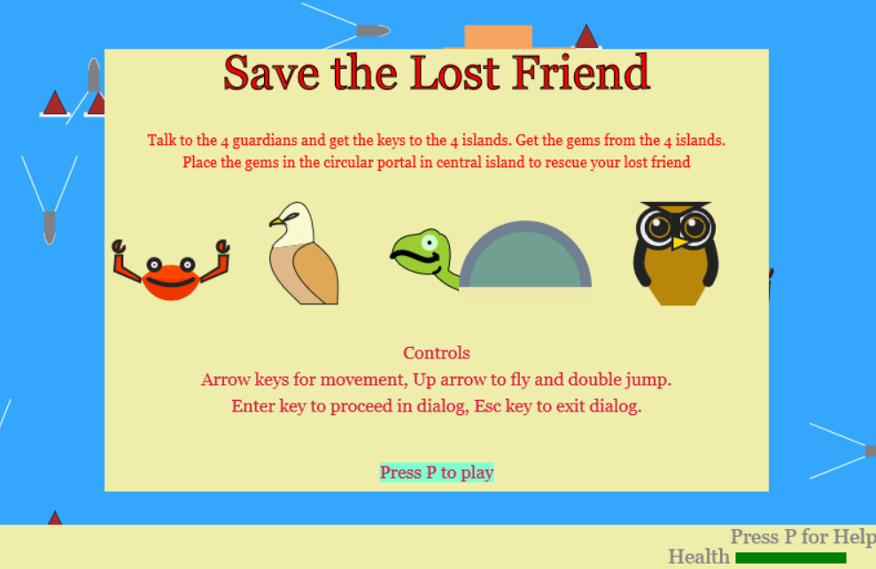
##### NPC dialog
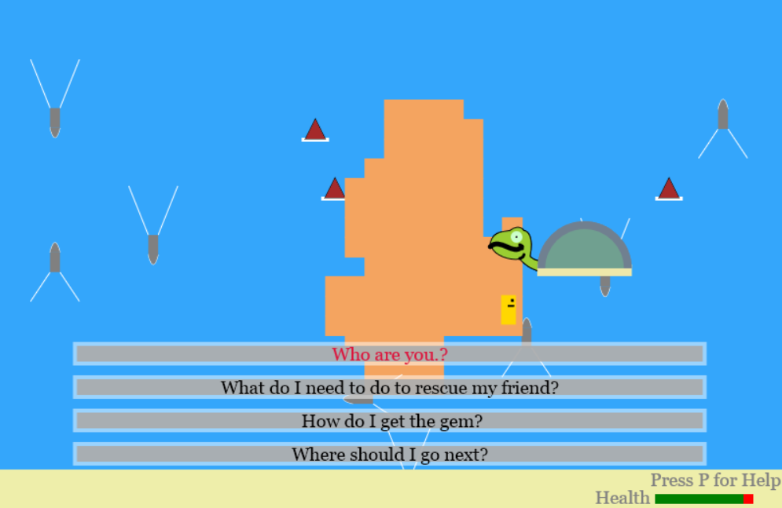
##### Portal to place the gems got from other levels
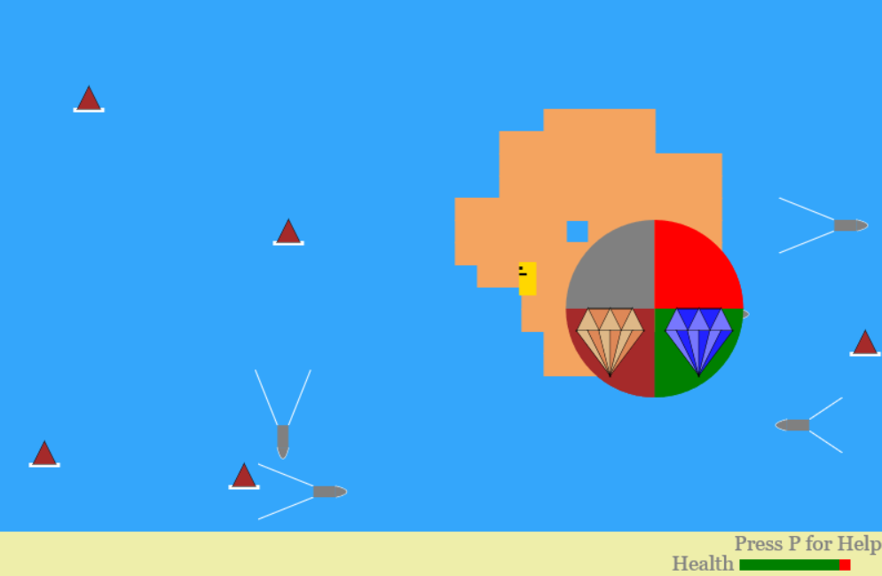
##### Win Screen
After all the gems are placed in the portal the game is over.
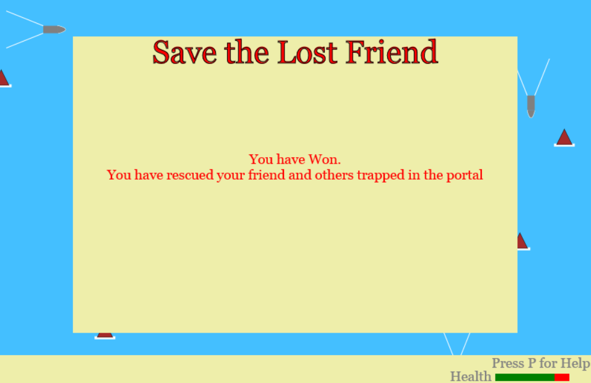

#### Water Island Level
The Tortoise NPC provides the key for this level. This is a top down 2d level where the player has to use the floating logs to reach the water island gem at the top and avoid falling in to the water.

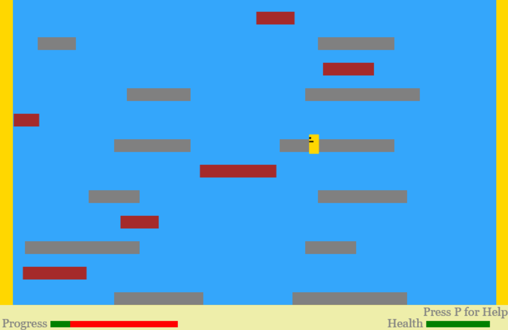
##### Water Island gem
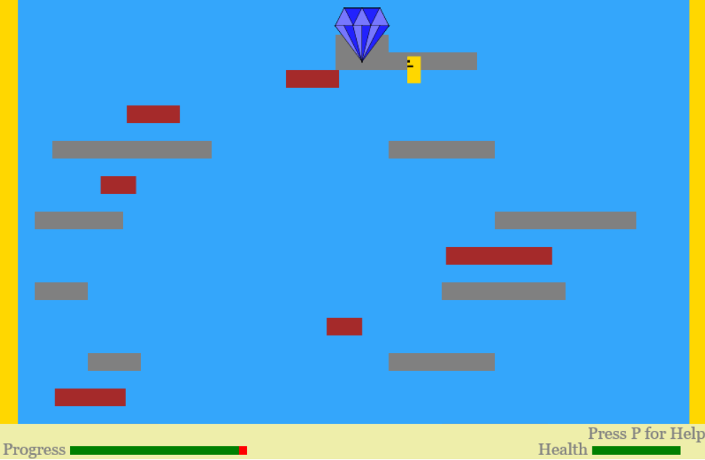

#### Earth Island Level
The Crab NPC provides the key for this level. This is a 2d plaformer level where the player has do jump or double jump to avoid the cactus to reach the gem at the far right. The player is moved in the right side direction automatically.

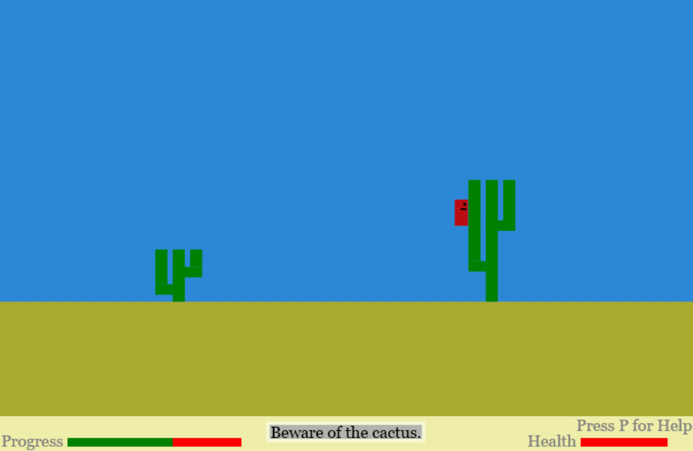
##### Earth Island gem
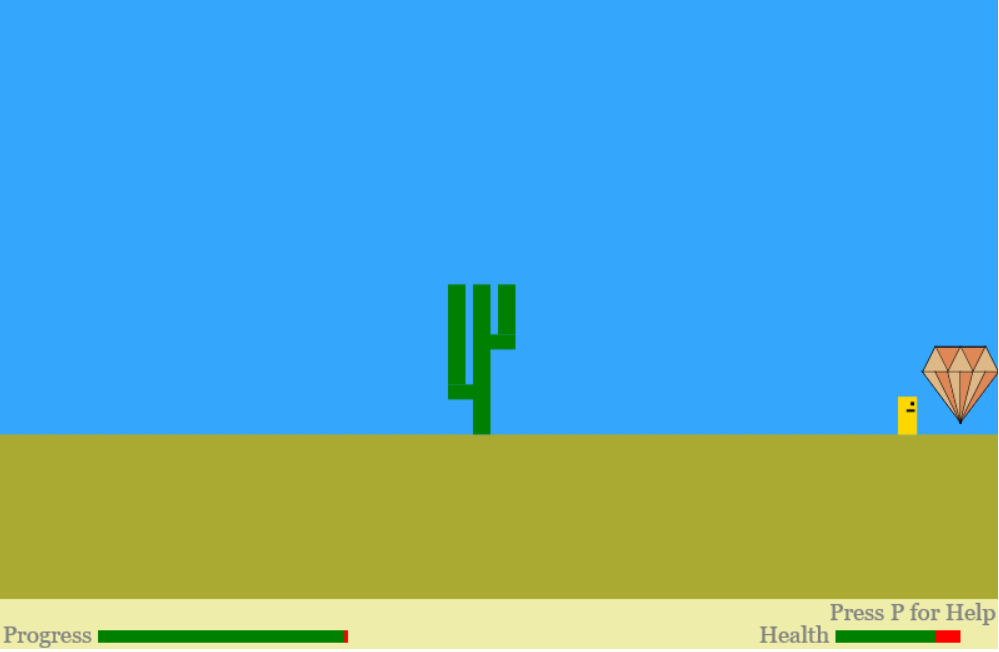

#### Air Island Level
The Owl NPC provides the key for this level. This is a 2d platformer level where the player has to fly upwards using the UP arrow key. The air island gem is at the top and the player has to avoid the evil black clouds.
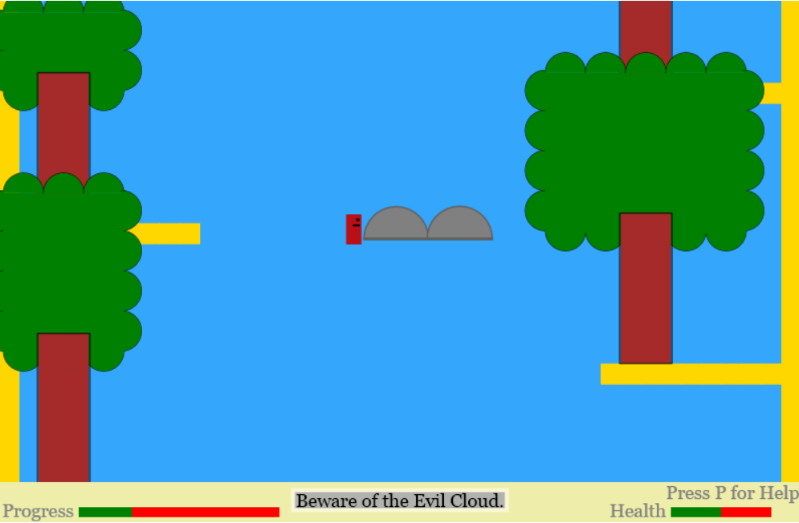
##### Earth Island gem
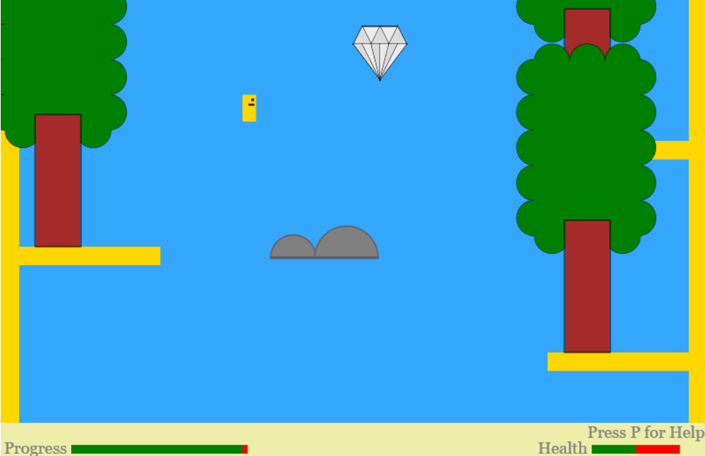

#### Fire Island Level
The Eagle NPC provides the key for this level. This is a 2d platformer level where the player has to do jump or double jump to avoid the Lava and the fire bolt. The fire island gem is at the far right. Health can be gained by picking the berries in the trees.
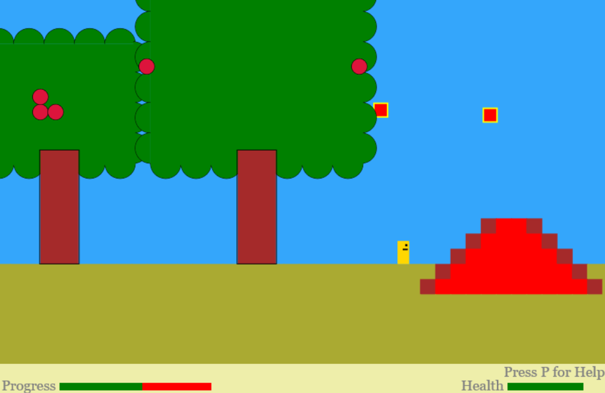
##### Earth Island gem
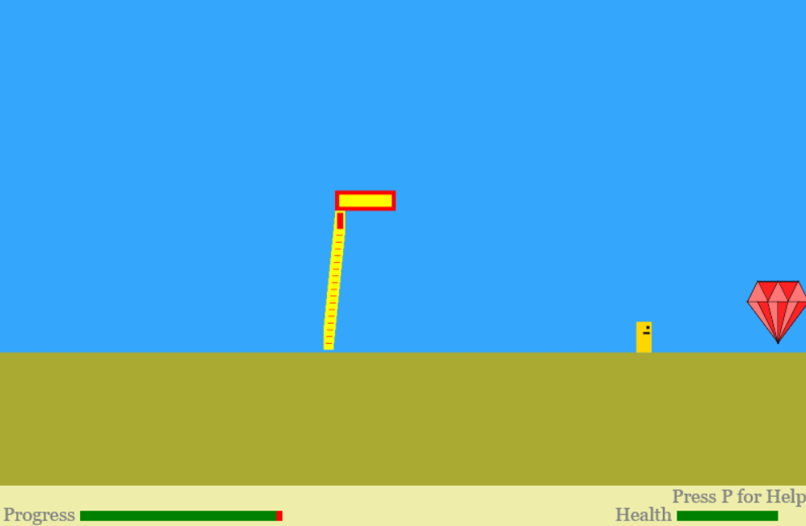

